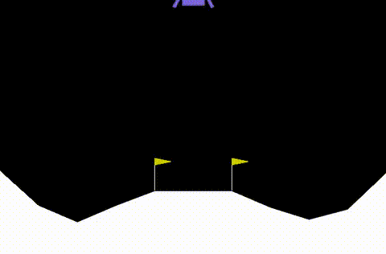

# Lunar Lander (Reinforcement Learning)

This project implements a reinforcement learning agent to solve the **Lunar Lander** environment from [Gymnasium](https://gymnasium.farama.org/).  
The agent learns to control a lander and safely land it between flags using techniques from Deep Reinforcement Learning.

---

## Run in Google Colab

No setup required — just click below to get your own copy of the notebook and run it in Google Colab:

---

## Project Overview
- **Environment:** LunarLander-v2 (Gymnasium)
- **Goal:** Land the spacecraft smoothly without crashing
- **Approach:** Deep Q-Network (DQN) agent with experience replay and target networks
- **Tools:** Python, PyTorch, Gymnasium, NumPy, Matplotlib

---

## Results
After training, the agent successfully learns to land the spacecraft with consistent scores above the environment’s success threshold.  

---

## Repository Structure
- Deep_Q_Learning_for_Lunar_Landing.ipynb # Main notebook with training and evaluation
- deep_q_learning_for_lunar_landing.py # Same code as .py file
- requirements.txt # dependencies (for reference; Colab handles these automatically) 
- landing.gif # Demonstration of trained agent
- README.md # Project overview (this file)

---

## Notes

- This project was built and tested in **Google Colab** for reproducibility.  
- Local setup may require additional steps (e.g., Box2D installation), so Colab is the recommended way to run it.  
